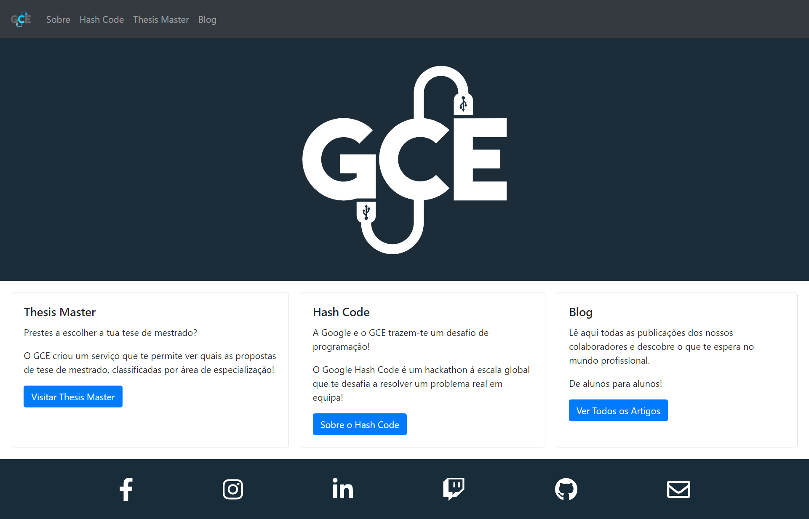

<!-- PROJECT SHIELDS -->
<!--
[![Contributors][contributors-shield]][contributors-url]
[![Forks][forks-shield]][forks-url]
[![Stargazers][stars-shield]][stars-url]
[![Issues][issues-shield]][issues-url]
[![MIT License][license-shield]][license-url]
[![LinkedIn][linkedin-shield]][linkedin-url]
[contributors-shield]: https://img.shields.io/github/contributors/othneildrew/Best-README-Template.svg?style=for-the-badge
[contributors-url]: https://github.com/othneildrew/Best-README-Template/graphs/contributors
[forks-shield]: https://img.shields.io/github/forks/othneildrew/Best-README-Template.svg?style=for-the-badge
[forks-url]: https://github.com/othneildrew/Best-README-Template/network/members
[stars-shield]: https://img.shields.io/github/stars/othneildrew/Best-README-Template.svg?style=for-the-badge
[stars-url]: https://github.com/othneildrew/Best-README-Template/stargazers
[issues-shield]: https://img.shields.io/github/issues/othneildrew/Best-README-Template.svg?style=for-the-badge
[issues-url]: https://github.com/othneildrew/Best-README-Template/issues
[license-shield]: https://img.shields.io/github/license/othneildrew/Best-README-Template.svg?style=for-the-badge
[license-url]: https://github.com/othneildrew/Best-README-Template/blob/master/LICENSE.txt
[linkedin-shield]: https://img.shields.io/badge/-LinkedIn-black.svg?style=for-the-badge&logo=linkedin&colorB=555
[linkedin-url]: https://linkedin.com/in/othneildrew
[product-screenshot]: images/screenshot.png
[](https://app.netlify.com/sites/gce-website/deploys)
-->

<!-- PROJECT LOGO -->
<br />
<p align="center">
  <a href="https://gce-website.netlify.app/">
    
  </a>

  <h3 align="center">GCE Website</h3>

  <p align="center">
    A showcase website and a blog all in one!
    <br />
    <a href="https://gce-website.netlify.app/"><strong>Go to Website »</strong></a>
    <br />
    <br />
    <a href="https://github.com/gce-neiist/gce-website/issues">Report Bug</a>
    ·
    <a href="https://github.com/gce-neiist/gce-website/issues">Request Feature</a>
  </p>
</p>

<!-- ABOUT THE PROJECT -->
## About The Project

A showcase website and a blog all in one where you can learn all about GCE and what we are up to and read about LMeic related stuff.



### Built With
* [React](https://reactjs.org/)
* [React Bootstrap](https://react-bootstrap.github.io/)
* [Contenful](https://www.contentful.com/)

<!-- GETTING STARTED -->
## Getting Started

### Pre-Requisites

1. Install [Node.js and NPM](https://nodejs.org/en/download/)
You can verify that the installation has been successful by running
    ```sh
    node -v
    npm -v
    ```

### Installation and Configuration

1. Clone the Github repository
    ```sh
    git clone https://github.com/gce-neiist/gce-website.git
    ```

2. Install the required NPM packages
    ```sh
    npm install
    ```

3. Log into [Contentful](https://be.contentful.com/login)

4. Open GCE Website's space (the top left corner lists all spaces)

5. Navigate to the Settings > API keys > React Website

6. Get the *Space ID* and the *Content Delivery API - Access Token*

7. Duplicate *.env.example* and name it *.env*
    ```sh
    cp .env.example .env
    ```

8. Fill in the *.env* with the API keys you just got from Contentful so that it looks like
    ```javascript
    REACT_APP_CONTENTFUL_SPACE=the_space_id_goes_here
    REACT_APP_CONTENTFUL_ACCESSTOKEN=the_access_token_goes_here
    ```

### Running

1. Run the app in development mode
    ```sh
    npm start
    ```

2. Open http://localhost:3000 to view it in the browser

<!-- USAGE EXAMPLES -->
<!--
## Usage

Use this space to show useful examples of how a project can be used. Additional screenshots, code examples and demos work well in this space. You may also link to more resources.

_For more examples, please refer to the [Documentation](https://example.com)_
-->

<!-- ROADMAP -->
<!--
## Roadmap

See the [open issues](https://github.com/othneildrew/Best-README-Template/issues) for a list of proposed features (and known issues).
-->

<!-- CONTRIBUTING -->
<!--
## Contributing

Contributions are what make the open source community such an amazing place to be learn, inspire, and create. Any contributions you make are **greatly appreciated**.

1. Fork the Project
2. Create your Feature Branch (`git checkout -b feature/AmazingFeature`)
3. Commit your Changes (`git commit -m 'Add some AmazingFeature'`)
4. Push to the Branch (`git push origin feature/AmazingFeature`)
5. Open a Pull Request
-->

<!-- LICENSE -->
<!--
## License

Distributed under the MIT License. See `LICENSE` for more information.
-->

<!-- CONTACT -->
<!--
## Contact

Your Name - [@your_twitter](https://twitter.com/your_username) - email@example.com

Project Link: [https://github.com/your_username/repo_name](https://github.com/your_username/repo_name)
-->

<!-- ACKNOWLEDGEMENTS -->
<!--
## Acknowledgements
* [GitHub Emoji Cheat Sheet](https://www.webpagefx.com/tools/emoji-cheat-sheet)
* [Img Shields](https://shields.io)
* [Choose an Open Source License](https://choosealicense.com)
* [GitHub Pages](https://pages.github.com)
* [Animate.css](https://daneden.github.io/animate.css)
* [Loaders.css](https://connoratherton.com/loaders)
* [Slick Carousel](https://kenwheeler.github.io/slick)
* [Smooth Scroll](https://github.com/cferdinandi/smooth-scroll)
* [Sticky Kit](http://leafo.net/sticky-kit)
* [JVectorMap](http://jvectormap.com)
* [Font Awesome](https://fontawesome.com)
* [Best-README-Template](https://github.com/othneildrew/Best-README-Template)
-->