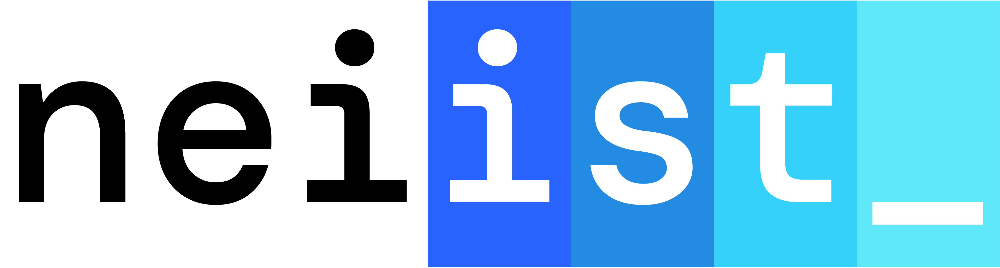

<!-- PROJECT SHIELDS -->
<!-- [![Contributors][contributors-shield]][contributors-url]
[![Forks][forks-shield]][forks-url]
[![Stargazers][stars-shield]][stars-url]
[![Issues][issues-shield]][issues-url]
[![MIT License][license-shield]][license-url]
[![LinkedIn][linkedin-shield]][linkedin-url] -->


<!-- PROJECT LOGO -->
<br />
<p align="center">
  <a href="https://neiist.tecnico.ulisboa.pt/">
    
  </a>

  <h3 align="center">NEIIST Website</h3>

  <p align="center">
    A website where you can keep up to date with NEIIST.<br>
    A platform to help students find the right Master's thesis.<br>
    A place for NEIIST's members to get involved with the association. 
    <br />
    <a href="https://neiist.tecnico.ulisboa.pt"><strong>Go to Website »</strong></a>
    <br />
    <br />
    <!-- <a href="https://github.com/othneildrew/Best-README-Template">View Demo</a>
    · -->
    <a href="https://github.com/neiist-dev/neiist-website/issues">Report Bug</a>
    ·
    <a href="https://github.com/neiist-dev/neiist-website/issues">Request Feature</a>
  </p>
</p>


<!-- TABLE OF CONTENTS -->
<!-- <details open="open">
  <summary>Table of Contents</summary>
  <ol>
    <li>
      <a href="#about-the-project">About The Project</a>
      <ul>
        <li><a href="#built-with">Built With</a></li>
      </ul>
    </li>
    <li>
      <a href="#getting-started">Getting Started</a>
      <ul>
        <li><a href="#prerequisites">Prerequisites</a></li>
        <li><a href="#installation">Installation</a></li>
      </ul>
    </li>
    <li><a href="#usage">Usage</a></li>
    <li><a href="#roadmap">Roadmap</a></li>
    <li><a href="#contributing">Contributing</a></li>
    <li><a href="#license">License</a></li>
    <li><a href="#contact">Contact</a></li>
    <li><a href="#acknowledgements">Acknowledgements</a></li>
  </ol>
</details> -->


<!-- ABOUT THE PROJECT -->
<!-- ## About The Project

[![Product Name Screen Shot][product-screenshot]](https://example.com)

There are many great README templates available on GitHub, however, I didn't find one that really suit my needs so I created this enhanced one. I want to create a README template so amazing that it'll be the last one you ever need -- I think this is it.

Here's why:
* Your time should be focused on creating something amazing. A project that solves a problem and helps others
* You shouldn't be doing the same tasks over and over like creating a README from scratch
* You should implement DRY principles to the rest of your life :smile:

Of course, no one template will serve all projects since your needs may be different. So I'll be adding more in the near future. You may also suggest changes by forking this repo and creating a pull request or opening an issue. Thanks to all the people have have contributed to expanding this template!

A list of commonly used resources that I find helpful are listed in the acknowledgements. -->

### Built With 

> [React](https://reactjs.org/), [React Bootstrap](https://react-bootstrap.github.io/), [Node.js](https://nodejs.org/en/), [Express](http://expressjs.com/), [PostgreSQL](https://www.postgresql.org/)


<!-- GETTING STARTED -->
## Getting Started

<!-- This is an example of how you may give instructions on setting up your project locally. -->
To get a local copy up and running follow these simple example steps.

### Prerequisites

<!-- This is an example of how to list things you need to use the software and how to install them. -->

* **Node.js** (Version 21.4.0)
  ```sh
  sudo apt install nodejs
  ```

* **NPM** (Version 10.2.4)
  ```sh
  sudo apt install npm
  ```

> ❗ You can also use Node Version Manager ([NVM](https://github.com/nvm-sh/nvm)) to install Node.js and NPM

* **PostgreSQL**
  ```sh
  sudo apt install postgresql
  ```
  ...or use Docker ([see below](?tab=readme-ov-file#alternative-docker-for-database))

### Installation

1. Create a Fénix application with a Redirect Url of `http://localhost:3000/` and a Scope of `Informações` at [https://fenix.tecnico.ulisboa.pt/personal/external-applications/#/applications](https://fenix.tecnico.ulisboa.pt/personal/external-applications/#/applications)
2. Create a PostgreSQL database
   ```sh
   sudo -i -u postgres
   psql
   CREATE DATABASE neiist;
   \q
   exit
   ```
3. Clone the repo
   ```sh
   cd folder-where-i-keep-my-repos/
   git clone https://github.com/neiist-dev/neiist-website.git
   ```
4. Server: Install NPM packages
   ```sh
   cd server/
   npm install
   ```
5. Server: Create .env file
   ```sh
   cp .env.example .env
   ```
6. Server: Populate the .env file with your Fénix application and database credentials
7. Server: Run
   ```sh
   npm start
   ```
8. Client: Install NPM packages
   ```sh
   cd ../client/
   npm install
   ```
9. Client: Create .env file
   ```sh
   cp .env.example .env
   ```
10. Client: Populate the .env file with your Fénix application credentials
11. Client: Run
    ```sh
    npm start
    ```


### Alternative: Docker for database

1. Pull postgres image
   ```sh
   docker pull postgres:alpine
   ```
2. Create and run the container
   ```sh
   docker run -itd -e POSTGRES_PASSWORD=<PASSWORD> -p 5432:5432 -v <HOST_FOLDER>:/var/lib/postgresql/data --name postgresql postgres:alpine
   ```
3. Create database
   ```sh
   docker exec -it postgresql bash
   psql -U postgres
   CREATE DATABASE neiist;
   \q
   exit
   ```
Note: the env variable PGHOST should be localhost


<!-- USAGE EXAMPLES -->
<!-- ## Usage

Use this space to show useful examples of how a project can be used. Additional screenshots, code examples and demos work well in this space. You may also link to more resources.

_For more examples, please refer to the [Documentation](https://example.com)_ -->


<!-- ROADMAP -->
<!-- ## Roadmap

See the [open issues](https://github.com/othneildrew/Best-README-Template/issues) for a list of proposed features (and known issues). -->


<!-- CONTRIBUTING -->
<!-- ## Contributing

Contributions are what make the open source community such an amazing place to be learn, inspire, and create. Any contributions you make are **greatly appreciated**.

1. Fork the Project
2. Create your Feature Branch (`git checkout -b feature/AmazingFeature`)
3. Commit your Changes (`git commit -m 'Add some AmazingFeature'`)
4. Push to the Branch (`git push origin feature/AmazingFeature`)
5. Open a Pull Request -->


<!-- LICENSE -->
<!-- ## License

Distributed under the MIT License. See `LICENSE` for more information. -->


<!-- CONTACT -->
<!-- ## Contact

Your Name - [@your_twitter](https://twitter.com/your_username) - email@example.com

Project Link: [https://github.com/your_username/repo_name](https://github.com/your_username/repo_name) -->


<!-- ACKNOWLEDGEMENTS -->
<!-- ## Acknowledgements
* [GitHub Emoji Cheat Sheet](https://www.webpagefx.com/tools/emoji-cheat-sheet)
* [Img Shields](https://shields.io)
* [Choose an Open Source License](https://choosealicense.com)
* [GitHub Pages](https://pages.github.com)
* [Animate.css](https://daneden.github.io/animate.css)
* [Loaders.css](https://connoratherton.com/loaders)
* [Slick Carousel](https://kenwheeler.github.io/slick)
* [Smooth Scroll](https://github.com/cferdinandi/smooth-scroll)
* [Sticky Kit](http://leafo.net/sticky-kit)
* [JVectorMap](http://jvectormap.com)
* [Font Awesome](https://fontawesome.com) -->


<!-- MARKDOWN LINKS & IMAGES -->
<!-- https://www.markdownguide.org/basic-syntax/#reference-style-links -->
<!-- [contributors-shield]: https://img.shields.io/github/contributors/othneildrew/Best-README-Template.svg?style=for-the-badge
[contributors-url]: https://github.com/othneildrew/Best-README-Template/graphs/contributors
[forks-shield]: https://img.shields.io/github/forks/othneildrew/Best-README-Template.svg?style=for-the-badge
[forks-url]: https://github.com/othneildrew/Best-README-Template/network/members
[stars-shield]: https://img.shields.io/github/stars/othneildrew/Best-README-Template.svg?style=for-the-badge
[stars-url]: https://github.com/othneildrew/Best-README-Template/stargazers
[issues-shield]: https://img.shields.io/github/issues/othneildrew/Best-README-Template.svg?style=for-the-badge
[issues-url]: https://github.com/othneildrew/Best-README-Template/issues
[license-shield]: https://img.shields.io/github/license/othneildrew/Best-README-Template.svg?style=for-the-badge
[license-url]: https://github.com/othneildrew/Best-README-Template/blob/master/LICENSE.txt
[linkedin-shield]: https://img.shields.io/badge/-LinkedIn-black.svg?style=for-the-badge&logo=linkedin&colorB=555
[linkedin-url]: https://linkedin.com/in/othneildrew
[product-screenshot]: images/screenshot.png -->
